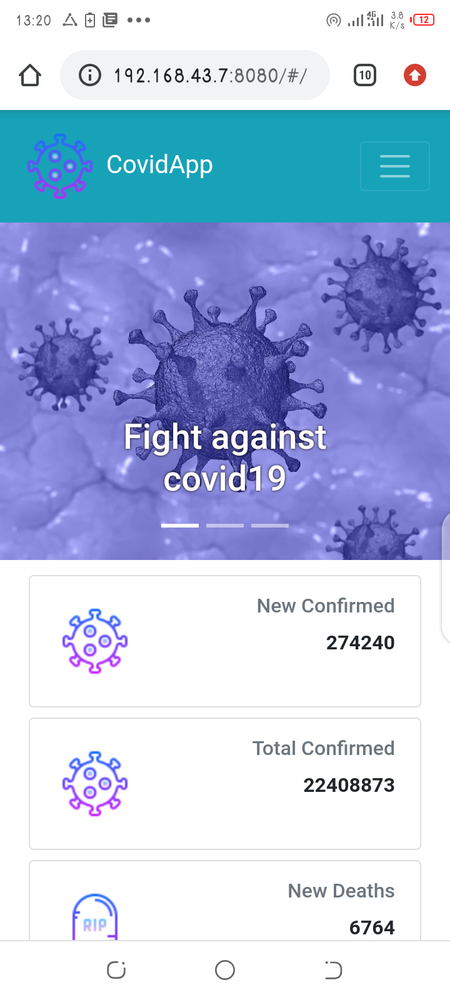
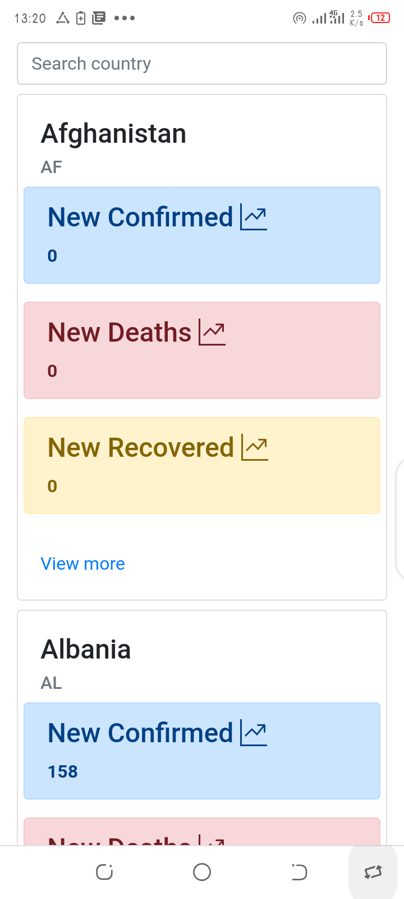
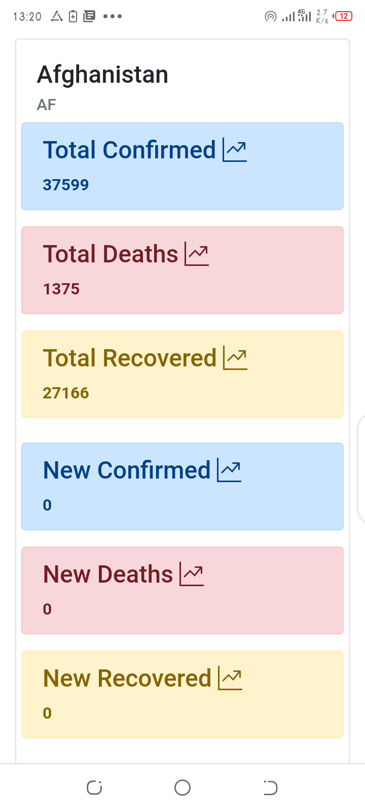

# covid-app
```
A web application to inform people about the evolution of covid-19 in the world
```

## Features
+ Show global case
+ quickly get information by searching by country
+ see all the information for a specific country

## Examples





## Contribute
```
Every contributions are welcome
```